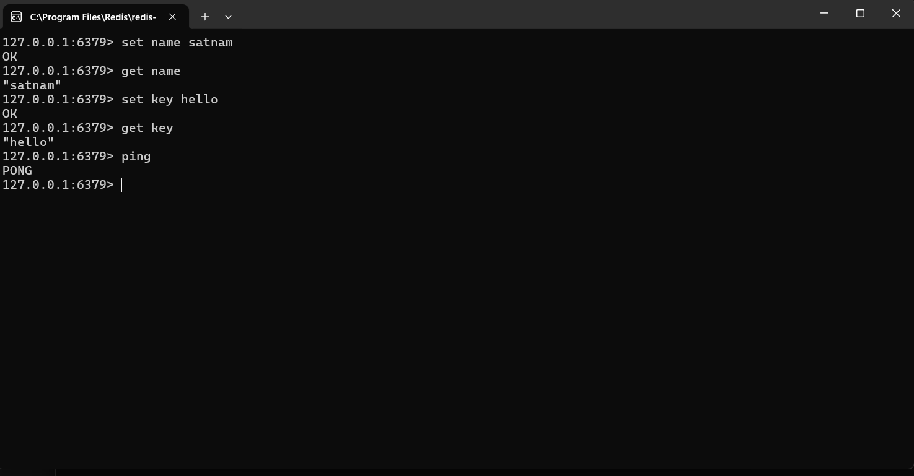
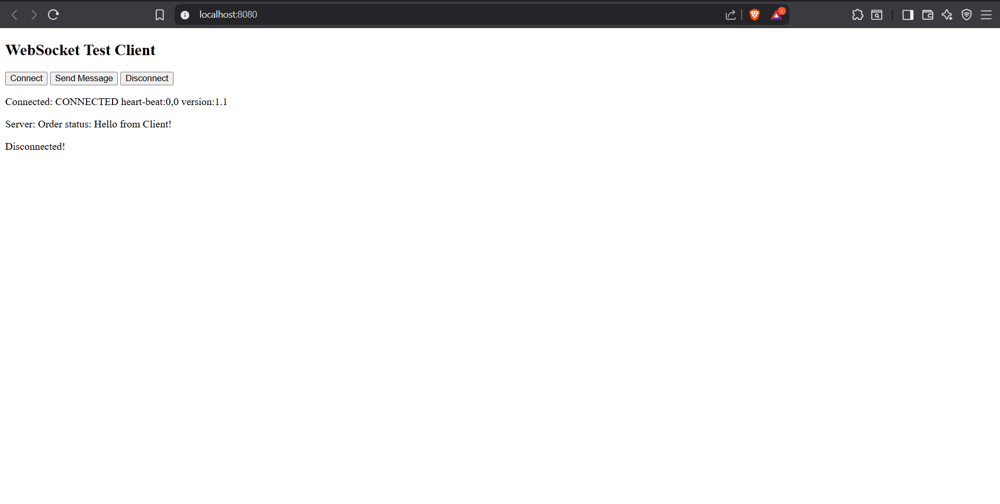

# FoodiesAPI

FoodiesAPI is a **Spring Boot microservice** built for managing users in a scalable, secure, and production-ready manner.  
It includes **user authentication, real-time communication, messaging, caching, search, file uploads, and logging**, demonstrating full-stack backend capabilities.

---

## **Project Description**

This project addresses the need for a **robust user management system** for modern applications like food ordering platforms.

Key highlights:

- Secure **User Authentication** with JWT and MySQL
- CRUD operations with validation and exception handling
- Real-time updates using **WebSocket**
- Messaging integration with **Kafka**
- Caching with **Redis** for fast data access
- Full-text search with **Elasticsearch**
- File storage with **AWS S3**
- Monitoring and logging with **Spring Actuator + ELK stack**

The project follows **microservice principles**, making it **scalable, maintainable, and deployment-ready**.

---

## **Key Features**

- **User Authentication** (JWT + MySQL)
- **User CRUD Operations** with validations and exception handling
- **WebSocket** communication for real-time notifications
- **Kafka** messaging integration
- **Redis** caching
- **Elasticsearch** search support
- **AWS S3** file uploads
- **Spring Actuator + ELK Logging**

---

## **Tech Stack & Tools**

- **Backend:** Java, Spring Boot
- **Build Tool:** Maven
- **Caching & Messaging:** Redis, Kafka
- **Search Engine:** Elasticsearch
- **Cloud Storage:** AWS S3
- **Database:** MySQL (`foodies_db`)
- **API Testing:** Postman
- **Logging & Monitoring:** Spring Actuator + ELK Stack

---

## **Project Structure**

FoodiesAPI/
├── .idea/
├── .mvn/
├── logs/
├── src/
│ ├── main/
│ │ ├── java/com/satnam/codesapi/user_service/
│ │ │ ├── config/
│ │ │ ├── controller/
│ │ │ ├── dto/
│ │ │ ├── entity/
│ │ │ ├── event/
│ │ │ ├── exception/
│ │ │ ├── kafka/
│ │ │ ├── model/
│ │ │ ├── repository/
│ │ │ ├── service/
│ │ │ ├── LombokTest.java
│ │ │ ├── MainTest.java
│ │ │ └── UserServiceApplication.java
│ │ └── resources/
│ │ ├── application.properties
│ │ └── static/
│ └── test/
├── target/
├── docker/
├── docker-compose.yml
├── Dockerfile
├── HELP.md
├── mvnw
├── mvnw.cmd
├── pom.xml
├── .gitignore
├── .gitattributes
└── README.md

---

## **How to Run Locally**

### **1. Clone the repository**
bash
git clone <your-github-repo-url>
cd FoodiesAPI

Build & Run (Future Docker setup)

  

mvn spring-boot:run

Open browser at http://localhost:8080

## Test REST APIs via Postman

Access WebSocket demo at /ws endpoint

API Endpoints / Demo
Endpoint	Method	Description
1. /users	GET	Get all users
2. /users/{id}	GET	Get user by ID
3. /users	POST	Create a new user
4. /users/{id}	PUT	Update user by ID
5. /users/{id}	DELETE	Delete user by ID
6. /auth/login	POST	User login with JWT
7. /auth/register	POST	User registration
8. /ws	GET	WebSocket test page

Screenshots / Demo
### 🔹 AWS S3 Upload Demo  
  

### 🔹 Redis Cache Demo  
  

### 🔹 WebSocket Demo  
  

## Author

Satnam Singh Ramavath

GitHub: https://github.com/satnamsinghr

Email: satnamsinghramavath9320@gmail.com

## Future Enhancements

Dockerize backend and run containerized services

Deploy on AWS EC2 with CI/CD (GitHub Actions)

Add unit and integration tests

Add role-based authorization (JWT/OAuth2)

Expand microservice modules beyond user service
